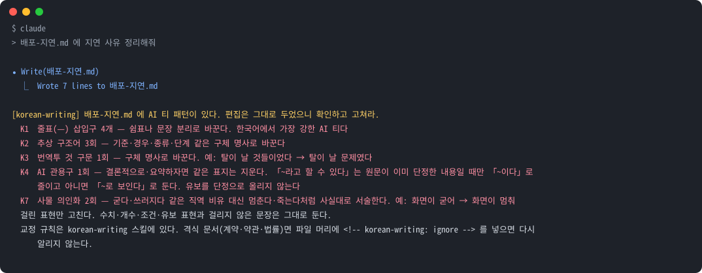

<picture>
  <source media="(prefers-color-scheme: dark)" srcset="docs/banner.en.svg">
  <source media="(prefers-color-scheme: light)" srcset="docs/banner-light.en.svg">
  
</picture>

<p align="center">
  <a href="README.md">한국어</a> · <strong>English</strong>
</p>

<p align="center">
  <strong>The plugin that owns every piece of Korean Claude Code writes.</strong><br>
  Rides along in ordinary replies, catches problems as text is written, polishes text that already exists, and checks every <code>.md</code> edit.
</p>

<p align="center">
  <a href="https://github.com/IsthisLee/claude-korean-writing/actions/workflows/validate.yml"></a>
  
  
  
  
  
</p>

<p align="center">
  <a href="#overview">Overview</a> ·
  <a href="#install">Install</a> ·
  <a href="#how-to-use">How to use</a> ·
  <a href="#how-it-works">How it works</a> ·
  <a href="#file-layout">File layout</a> ·
  <a href="#what-the-hook-catches">What the hook catches</a> ·
  <a href="#what-it-covers">What it covers</a> ·
  <a href="#verification">Verification</a> ·
  <a href="#faq">FAQ</a>
</p>

> **v1.0.0**: First release. Four skills (first draft, polish, character count, README structure), a hook that checks `.md` edits, and scripts for whole-document checks and releases. Details: [CHANGELOG.md](CHANGELOG.md) (Korean).

> **korean-writing owns the quality of every piece of Korean Claude Code writes.** Install it and the rules ride along in ordinary replies. Say **"운영팀에 보낼 안내문 써줘"** (write a notice for the ops team) and the rules load on their own, so the text comes out as natural Korean from the first draft. Edit a `.md` file and a hook flags translation-ese and AI idioms. Nothing you write leaves your machine.

## Overview

Claude Code writes grammatical Korean. It still reads wrong, because the sentences keep the shape of the English underneath. Below are sentences it actually produced, and their corrections.

| Before                                                              | After                                                              | What was wrong                                                                      |
| ------------------------------------------------------------------- | ------------------------------------------------------------------ | ----------------------------------------------------------------------------------- |
| 변경이 실패하면 화면이 **굳어** 취소도 안 됩니다                    | 변경이 실패하면 화면이 **멈춰** 취소도 안 됩니다                   | "The screen freezes": a calque. Korean says the screen _stops_                      |
| 점검 장치가 장비를 계속 **넘어뜨리고 있었습니다**                   | 점검 장치 **때문에** 장비가 계속 **멈췄습니다**                    | "Kept knocking the server over": a personified object                               |
| 그대로 내보냈으면 탈이 날 **것들이었습니다**                        | 그대로 내보냈으면 탈이 날 **문제였습니다**                         | "Things that would have...": the empty noun 것 standing in for a real one           |
| **축이** 두 개다. 세 **갈래**로 나뉜다                              | **기준이** 두 개다. 세 **가지**로 나뉜다                           | "Two axes, three branches": abstract structure words where a plain noun works       |
| 충돌하면 상위 문서가 **이깁니다**                                   | 충돌하면 상위 문서를 **따릅니다**                                  | "The upper document wins": a win/lose metaphor that an editor flagged as an AI tell |
| 원인은 힙 부족이 아니라 **—** 실측해보니 **—** 설정이 안 먹혔습니다 | 원인은 힙 부족이 아니었습니다**.** 실측해보니 설정이 안 먹혔습니다 | An em-dash interjection. Korean punctuation does not do this                        |

Nothing in the left column is ungrammatical. It is simply not what a person writing in Korean produces. This plugin attaches to the five points where such sentences leave Claude Code, plus one more for README structure.

| Where                         | What attaches                      | What it does                                                                                                |
| ----------------------------- | ---------------------------------- | ----------------------------------------------------------------------------------------------------------- |
| Writing an ordinary reply     | SessionStart hook (always-on rules) | Injects a rule summary once when the session opens, covering replies where no skill loads                  |
| Writing a first draft         | `korean-writing` skill             | Loads on requests for Slack messages, mail, notices, and reports, and applies the rules from the first line |
| Fixing existing text          | `humanize-korean` skill            | Changes style only; facts and numbers stay untouched                                                        |
| Editing a `.md` file          | PostToolUse hook                   | Scans what was just written for eight AI-tell patterns and reports them                                     |
| Counting under a length limit | `korean-character-count` skill     | A script counts, so the model does not estimate                                                             |
| Writing a README              | `crafting-effective-readmes` skill | Picks the sections for the project type; the sentences follow the `korean-writing` rules                    |

> Think of a copy editor sitting next to the draft. Instead of fixing the text after it is finished, they point at the awkward sentence while it is being written.

## Install

```bash
claude plugin marketplace add IsthisLee/claude-korean-writing
claude plugin install korean-writing
```

That is the whole setup. There is nothing to configure.

A local checkout works as a marketplace too, for an internal copy or a fork.

```bash
claude plugin marketplace add /path/to/claude-korean-writing
claude plugin install korean-writing
```

**Requirements**

- Claude Code (verified on 2.1.266)
- `python3` for the hook and `node` for the character-count script. No extra packages
- The hook is a bash script. Verified on macOS; Windows is untested

## How to use

Talk to Claude Code as usual. The skills load themselves from the request; to call one directly, use its slash name.

| You want to                              | Say something like                                                                                                              | Direct call                                  |
| ---------------------------------------- | ------------------------------------------------------------------------------------------------------------------------------- | -------------------------------------------- |
| Write outgoing text well from the start  | "운영팀에 보낼 옵션 변경 안내문 써줘. 슬랙에 캐주얼하게." (write a casual Slack notice to the ops team about the option change) | `/korean-writing`                            |
| Strip translation-ese from existing text | "아래 글 번역투만 고쳐줘. 사실과 숫자는 그대로 두고." (fix only the translation-ese below; keep facts and numbers)              | `/korean-writing:humanize-korean`            |
| Count characters exactly                 | "이 자기소개서 공백 포함 몇 자야? 1,000자 제한이야." (how many characters including spaces? the limit is 1,000)                 | `/korean-writing:korean-character-count`     |
| Write a README                           | "이 프로젝트 README 써줘. 오픈소스용으로." (write a README for this project, open-source style)                                 | `/korean-writing:crafting-effective-readmes` |

The polish skill shows its three to six main edits as before → after, and if the change rate passes 50% it reports that instead of returning a result: at that point it is a rewrite, not a polish. Character counting uses grapheme clusters (what a reader sees as one character) and reports lines and bytes alongside. The README skill picks sections for one of four project types (open source, personal, internal, config) and writes the sentences under the `korean-writing` rules.

Edit a `.md` file and the hook checks it automatically. This is what it looks like:

<p align="center"></p>

It never reverts the edit. It lists what it found and how to fix it; whether to fix it is up to you.

To check existing documents in full, run `scripts/check.sh FILE...`. It applies the same rules as the hook and exits 1 if any file is flagged, so it works as-is in CI and pre-commit. The install path is the Path shown by `claude plugin list`.

```bash
scripts/check.sh docs/*.md
```

There are three ways to turn it off. To exempt one file, put `<!-- korean-writing: ignore -->` at the top; use this for documents where formality is the requirement, such as contracts. To silence a whole session, set `KOREAN_WRITING_HOOK_DISABLED=1`; to drop only the always-on rules, set `KOREAN_WRITING_ALWAYS_ON_DISABLED=1`. To disable the plugin, run `claude plugin disable korean-writing`.

## How it works

Four skills and one hook attach at different moments. A request selects a skill; saving a file runs the hook.

### Which skill answers

```
request
├─ text not written yet                 korean-writing               writes it under the rules from the first line
├─ "polish what I already wrote"        humanize-korean              touches style only, facts stay
├─ "count characters or bytes"          korean-character-count       a script counts
└─ "write or update the README"         crafting-effective-readmes   picks the sections; sentences follow korean-writing
```

The skills hand off to each other. Asked to polish text that does not exist yet, `humanize-korean` sends the request back to `korean-writing`; when a draft still misses the bar, `korean-writing` hands it to `humanize-korean`. Polishing splits anything over 5,000 Hangul characters into logical sections, and reports that a single pass is not enough for text over 8,000 characters or where accuracy matters most.

### From request to output

| Step      | What happens                                                                                                                                |
| --------- | ------------------------------------------------------------------------------------------------------------------------------------------- |
| 1 Request | A request such as "write a notice" is matched against the skill description. That description is the only thing loaded at all times         |
| 2 Load    | On a match, `SKILL.md` (principles, quality bar, worked corrections) is read and the text is written under those rules                      |
| 3 Judge   | When polishing, `references/quick-rules.md` is the first pass; only ambiguous cases open `references/taxonomy.md` (10 categories, 73 items) |
| 4 Edit    | Saving a `.md` runs the hook over the part just written, using regular expressions; hits go to stderr. No LLM call                          |

The three tiers exist for cost. Most of the time only the one-line description is loaded; the large files open only when a hard call has to be made.

```
SKILL.md                        7.7 KB   loaded on writing requests: principles, quality bar, corrections
references/quick-rules.md       9.7 KB   when polishing starts: compressed rulebook
references/taxonomy.md         66   KB   only for hard calls: 10 categories, 73 items
```

### How the hook decides

```
Edit · Write · MultiEdit finishes
  ├─ KOREAN_WRITING_HOOK_DISABLED=1, or no python3                          pass
  ├─ not a .md file                                                          pass
  ├─ korean-writing: ignore marker at the top of the file or in the edit      pass
  ├─ collect only what was just written  (content, new_string, edits[].new_string)
  ├─ drop code blocks · inline code · URLs · table rows · HTML comments
  ├─ if Hangul is under 30%, keep only lines that are at least 30% Hangul     (a Korean paragraph in an English document)
  ├─ fewer than 20 Hangul characters left                                     pass
  ├─ run the K1 to K8 regular expressions
  ├─ em-dashes: if the edit adds at least one, the whole file is counted     (they pile up paragraph by paragraph)
  └─ on a hit, print the items and how to fix them to stderr and exit 2. The file is left as is
```

Only the part just written is checked, because checking the whole file would re-flag old wording on every edit. Table rows are dropped entirely because of this README: the bad examples in the before column of the correction table were flagged. If an edit is mostly English but contains Korean paragraphs, only those lines are checked, so em-dashes in English prose are not counted. Em-dashes alone are counted over the whole file: real documents reached 34, 66 and 207 em-dashes while being edited one paragraph at a time, and counting only the edit never fired. An edit that adds none is never flagged, however many the file holds.

### Thresholds sit one notch below the rulebook

The hook informs; it does not block. A check that interrupts normal work gets switched off, so where the rulebook says "at most once per document", the hook fires from the second occurrence.

| Code                                            | Hook fires at                                               | Rulebook prescription                                                                                                               |
| ----------------------------------------------- | ----------------------------------------------------------- | ----------------------------------------------------------------------------------------------------------------------------------- |
| `K1` em-dash interjection                       | 4. If the edit adds at least one, the whole file is counted | `SKILL.md`: at most two per document. Taxonomy J-3: one or two in internal documents                                                |
| `K2` abstract structure words                   | 3                                                           | Taxonomy D-9: the four words combined, at most twice per document                                                                   |
| `K6` win/lose personification                   | 2                                                           | Taxonomy D-8: at most once per document                                                                                             |
| `K4` AI idioms                                  | 1                                                           | Taxonomy D: S1, replaced on first sight                                                                                             |
| `K5` mechanical enumeration                     | 첫째 and 둘째 both present                                  | Taxonomy C-1: S1                                                                                                                    |
| `K3` 것 constructions, `K7` personified objects | 1                                                           | Sentence rules in `SKILL.md`; both came from real failed sentences in the ground truth                                              |
| `K8` translation-ese                            | `~에 의해` 2, `가지고 있다` and double passive 1            | Taxonomy A-7 and A-8 are S1, A-9 is S2. Counting `~에 대해`·`~를 통해` was dropped: on real documents it only flagged human writing |

`K6` started at one occurrence and was raised to two because that was stricter than the rulebook. Such adjustments are recorded in [`EVALUATION.md`](./EVALUATION.md) under "측정 중 고친 것".

## File layout

| Part         | Count        | What                                                                                        |
| ------------ | ------------ | ------------------------------------------------------------------------------------------- |
| Skills       | 4            | `korean-writing`, `humanize-korean`, `korean-character-count`, `crafting-effective-readmes` |
| Hook         | 1            | PostToolUse, patterns `K1` to `K8`                                                          |
| Rulebooks    | 2            | `quick-rules.md` (compressed), `taxonomy.md` (10 categories, 73 items, severity, fixes)     |
| Scripts      | 4            | character count (`node`); whole-file check, corpus measurement and release (`bash`)         |
| Verification | 15 sentences | 10 violations, 5 clean. 43 regression cases                                                 |

```
korean-writing/
├── .github/
│   ├── workflows/validate.yml        regression suite, shellcheck, version sync and validate on push and PR
│   ├── ISSUE_TEMPLATE/               awkward sentence report, bug, rule proposal
│   ├── PULL_REQUEST_TEMPLATE.md      where you paste the commands you ran and what you measured
│   ├── CODEOWNERS                    reviewers for the rules and the vendored files
│   └── dependabot.yml                keeps GitHub Actions current
├── .claude/settings.json             shared project settings: verification commands allowed, vendored edits prompt
├── .claude-plugin/
│   ├── plugin.json                   manifest: name, version, the four skill paths. The version lives here
│   └── marketplace.json              marketplace catalog. Carries no version
├── SKILL.md                          the korean-writing skill: rules and corrections for first drafts
├── references/
│   ├── quick-rules.md                compressed rulebook for the first polishing pass
│   └── taxonomy.md                   AI-tell taxonomy: 10 categories, 73 items, severity, fixes
├── skills/
│   ├── humanize-korean/SKILL.md      polishing existing text: facts invariant, change-rate cap
│   ├── korean-character-count/
│   │   ├── SKILL.md                  how to pick the right number
│   │   ├── instruction.md            the counting contract: graphemes, line breaks, NEIS bytes
│   │   └── scripts/korean_character_count.js   the counter, node:fs only
│   └── crafting-effective-readmes/   README structure: 4 templates, 5 references
├── hooks/hooks.json                  registers both hooks: SessionStart and PostToolUse, 10 s limit each
├── hooks-handlers/
│   ├── always-on.md                  the reply rules injected each session, about 660 tokens
│   ├── sessionstart.sh               the injector: writes those rules to stdout
│   ├── posttooluse.sh                the checker: python3 regular expressions K1 to K8
│   ├── ground-truth.json             10 awkward sentences that were actually generated
│   ├── clean.json                    5 clean sentences from the same context
│   ├── test_posttooluse.py           43 regression cases; verifies reported counts to catch mutations
│   └── test_sessionstart.py          18 regression cases: injected text, kill switches, safe exit
├── docs/                             banners (Korean and English, light and dark), hook output demo, social preview
├── scripts/
│   ├── check.sh                      pushes whole files through the hook, for CI and pre-commit
│   ├── measure.sh                    false-positive measurement over a corpus of real documents, quarterly
│   └── release.sh                    version, CHANGELOG, badges and tag in one run
├── EVALUATION.md                     pass criteria and measurements
├── CHANGELOG.md                      release notes
├── CLAUDE.md                         rules for Claude working inside this repo
├── CONTRIBUTING.md · .en.md          how to contribute; rule changes need measurements
├── CODE_OF_CONDUCT.md                Contributor Covenant 2.1
├── SECURITY.md                       reporting process, and what the hook reads and never does
├── LICENSE                           MIT text
├── NOTICE.md                         original copyright notices and per-file scope of imported files
└── README.md · README.en.md
```

## What the hook catches

Editing a `.md` checks **only the part you just wrote**. Checking the whole file would re-flag old wording on every edit and turn the hook into noise.

| Code | Pattern                            | Example                                                                                     | Threshold                                             |
| ---- | ---------------------------------- | ------------------------------------------------------------------------------------------- | ----------------------------------------------------- |
| `K1` | Em-dash interjection               | `가 — 나 — 다`                                                                              | 4, counted over the whole file when the edit adds one |
| `K2` | Abstract structure words           | `축`·`갈래`·`결이 다`·`레이어` (axis, branch, "different grain", layer)                     | 3                                                     |
| `K3` | Translation-ese `것` constructions | `탈이 날 것들이었다`                                                                        | 1                                                     |
| `K4` | AI idioms                          | `결론적으로`·`혁신적`·`시사하는 바가 크다` (in conclusion, innovative, "highly suggestive") | 1                                                     |
| `K5` | Mechanical enumeration             | `첫째 … 둘째 …` (firstly... secondly...)                                                    | both present                                          |
| `K6` | Win/lose personification           | `규칙이 이깁니다` (the rule wins)                                                           | 2                                                     |
| `K7` | Personified objects                | `화면이 굳어`·`장비를 넘어뜨리고` (the screen freezes, knocks the server over)              | 1                                                     |
| `K8` | Translation-ese                    | `되어지`·`가지고 있다`·`~에 의해` (double passive, "have", by-passive)                      | per item                                              |

Code blocks (``` and ~~~), inline code, URLs, table rows, and HTML comments are skipped. If Hangul is under 30% of the edited part, only the lines that are at least 30% Hangul are kept (a Korean paragraph inside an English document); if those have fewer than 20 Hangul characters, the hook does not apply.

## Why these patterns

**The evidence is a publisher's editorial desk.** Reviewing a book manuscript, the editors singled out em-dash interjections and the `이깁니다` (wins) family: "these show up across manuscripts lately; not wrong, but they invite suspicion of AI generation." Two manuscripts by different authors had the same `이깁니다` in the same spot.

Grammatical or not, an expression that has hardened into an AI signature is avoided. That is the plugin's standard.

**The goal is not evading detectors.** It is turning awkward translation-ese into natural Korean, which improves the text regardless of who drafted it.

## Verification

Pass criteria and measurements are in [`EVALUATION.md`](./EVALUATION.md) (Korean).

| Criterion                         | Result           |
| --------------------------------- | ---------------- |
| Violations detected               | 10 / 10          |
| False positives on clean text     | 0 / 5            |
| False positives on real documents | 1 / 143 (0.7%)   |
| Correct classification            | 10 / 10          |
| Mutations caught                  | 15 / 15          |
| Regression tests                  | 61 / 61          |
| Network calls                     | 0                |
| Always-on rules, blind pairwise   | 21 win 0 loss 3 tie |
| Always-on context cost            | about 930 tokens |

The ground truth is [`hooks-handlers/ground-truth.json`](./hooks-handlers/ground-truth.json): **ten awkward sentences that were actually generated, plus five clean sentences from the same context.** No synthetic examples.

**False positives weigh more than misses.** A check that blocks normal work gets switched off.

The always-on rules were measured on twelve prompts with two conditions and two samples, 48 generations in all, judged blind by the same model twice per pair with the order swapped. The injected condition won 21 of 24 pairs with 3 ties and no losses, and it won or tied on all twelve prompts. A separate check that ignored style and looked only for technical errors found no serious errors in either condition. Details are in [`EVALUATION.md`](./EVALUATION.md), item C5.

A with/without comparison of the skill on four identical prompts is recorded in [`EVALUATION.md`](./EVALUATION.md), item C4. On claude-opus-5 as of 2026-09-10 both conditions passed the hook, so the generation-time effect could not be separated on that sample; the hook is the safety net that stays when the model changes.

Mutation testing injects defects into the hook and confirms the regression suite catches them, down to a single alternative silently dropping out of a regular expression.

```bash
python3 hooks-handlers/test_posttooluse.py
python3 hooks-handlers/test_sessionstart.py
```

GitHub Actions runs the same checks on every push and pull request (`.github/workflows/validate.yml`): the regression suite, JSON and YAML syntax for the manifests and issue forms, the hook's executable bit, thirteen Korean documents passing their own hook, and a character-count smoke test, all **on both macOS and Linux**. Three more jobs run shellcheck, verify the version is written the same way everywhere, and run `claude plugin validate`.

## Neighbors

| Tool                                                        | What it is                                                                                                      | How this plugin relates                                                                                                                                                                                |
| ----------------------------------------------------------- | --------------------------------------------------------------------------------------------------------------- | ------------------------------------------------------------------------------------------------------------------------------------------------------------------------------------------------------ |
| [claude-forge](https://github.com/sangrokjung/claude-forge) | A full Claude Code framework: agents, commands, hooks, rules. Its Korean prose guardrails are one part of it    | This plugin is that part, extracted. If you installed Forge in full with `install.sh`, you already have the same hook and polish skill and do not need this. Running both duplicates the em-dash check |
| [k-skill](https://github.com/NomaDamas/k-skill)             | A collection of 100+ skills for Korean users, from character counting and spell checking to transit and weather | Only the character-count skill was taken. The spell checker sends text to an external server, so it was left out; install it from k-skill if you need it, knowing that                                 |
| Spelling and spacing checkers                               | Check spelling                                                                                                  | This plugin checks style only. The two do not overlap, so use both                                                                                                                                     |

## What it covers

Here is what "every piece of Korean" means, spelled out.

| Where                                          | What owns it            | Status                                                        |
| ---------------------------------------------- | ----------------------- | ------------------------------------------------------------- |
| Ordinary chat replies                          | SessionStart rules      | Covered                                                       |
| Slack, mail, reports, commit messages, READMEs | `korean-writing` skill  | Covered                                                       |
| Polishing text that already exists             | `humanize-korean` skill | Covered                                                       |
| `.md` file edits                               | PostToolUse hook        | Covered; only what was just written                           |
| Korean comments and strings inside code        | SessionStart rules      | Generation only; the hook reads `.md` and does not check them |
| Korean written by subagents                    | SessionStart rules      | Unverified; whether the injection propagates was not measured |
| Text leaving through a tool, such as Slack     | SessionStart rules      | Generation only; nothing inspects it at send time             |

## Out of scope

- **Text where formality is the requirement**: contracts, terms of service, legal documents, official letters. Stiffness is the point there
- Code, logs, commands, direct quotations, proper nouns, English source text
- Spelling and spacing. This plugin looks at style only

Regular expressions catch known patterns. New kinds of awkwardness have to be found by a person and added to the list.

## FAQ

<details>
<summary><b>Q1. Does 10/10 detection mean it catches everything?</b></summary>

**A.** No. The patterns were built from those ten sentences, so catching them is expected; that number is a regression check. The meaningful number is the false-positive side: 143 real Korean documents on this machine were pushed through the hook in full; 60 were flagged, 59 of them written by Claude in 2026 and one by a person (0.7%). Regular expressions catch known patterns and miss new ones.

**Evidence:**

- [`EVALUATION.md`](./EVALUATION.md), criteria A1 and A3
- [`hooks-handlers/ground-truth.json`](./hooks-handlers/ground-truth.json)

</details>

<details>
<summary><b>Q2. Does the hook revert my edit?</b></summary>

**A.** No. It prints what it found to stderr and exits with code 2. The file is untouched; fixing it is your call.

</details>

<details>
<summary><b>Q3. Does my text leave my machine?</b></summary>

**A.** No. The hook is `python3` regular expressions and the counting script uses only `node:fs`. There is not a single network call. That is also why `korean-spell-check`, which posts text to an external server, was not brought in.

</details>

<details>
<summary><b>Q4. What if it flags something wrongly?</b></summary>

**A.** For formal documents (contracts, terms, legal), put `<!-- korean-writing: ignore -->` at the top of the file; that file is never flagged again. To silence a whole session, set `KOREAN_WRITING_HOOK_DISABLED=1`; to drop only the always-on rules, set `KOREAN_WRITING_ALWAYS_ON_DISABLED=1`. If the pattern itself is wrong, add the sentence to `hooks-handlers/test_posttooluse.py` as a false-positive case and fix the hook (see Development). To turn the hook off entirely: `claude plugin disable korean-writing`.

</details>

<details>
<summary><b>Q5. How many tokens does it cost?</b></summary>

**A.** The always-on cost is the four skill descriptions (about 270 tokens as reported by `/context`) plus the reply rules (659 tokens), about 930 in total. Against a session-start context of roughly ten thousand tokens that is a 6 to 7 percent increase. The rules go in once per session and land in the prompt cache, so they are not re-paid on every turn; the measured per-turn cost went from 0.0029 to 0.0031 dollars. Skill bodies load only on writing requests, and the hook is regular expressions with no LLM call. A Stop hook that re-reviews every reply was deliberately left out for the same reason.

</details>

<details>
<summary><b>Q6. Why only <code>.md</code> files?</b></summary>

**A.** The hook fires on file-editing tools only. A Slack message in a reply is not a file, so the hook cannot see it; that case belongs to the writing skill.

</details>

## Development and contributing

The full process, the measurements a rule change needs, and the PR checklist live in [CONTRIBUTING.en.md](./CONTRIBUTING.en.md). Everyone taking part follows the [Code of Conduct](./CODE_OF_CONDUCT.md), and security issues go through [SECURITY.md](./SECURITY.md) rather than a public issue.

Symlink the repository into `~/.claude/skills/` and it loads as `korean-writing@skills-dir`, bypassing the marketplace so changes apply immediately.

If a marketplace-installed copy exists, it takes precedence and the symlinked copy is not loaded. Run `claude plugin uninstall korean-writing` before developing.

```bash
git clone https://github.com/IsthisLee/claude-korean-writing.git
ln -s "$PWD/claude-korean-writing" ~/.claude/skills/korean-writing
claude plugin list                            # should show loaded
python3 hooks-handlers/test_posttooluse.py    # 43 regression cases
python3 hooks-handlers/test_sessionstart.py   # 18 regression cases
```

Adding a pattern touches three places:

1. `hooks-handlers/posttooluse.sh`: the check
2. `hooks-handlers/ground-truth.json`: a real sentence
3. `hooks-handlers/test_posttooluse.py`: the case, false-positive cases first

After changing a rule, run it over a corpus of real documents to see that false positives did not grow: `scripts/measure.sh ~/Documents` prints the flagged files and counts per code. Whether a flagged file was written by a person or by Claude is a human call.

**If you spot an awkward sentence, open an issue.** The ground truth uses only sentences that were actually generated. One real failure is worth more than any synthetic example. The issue form asks for the sentence, the request it came from, and whether the hook caught it.

## Versioning and releases

[SemVer](https://semver.org/). The version lives in `.claude-plugin/plugin.json` and nowhere else; the release script propagates it.

| Bump  | When                                                                                              |
| ----- | ------------------------------------------------------------------------------------------------- |
| Patch | Fewer false positives, wording, docs                                                              |
| Minor | A new pattern or skill, a threshold that catches more, a change of purpose or structure           |
| Major | A change in the contract, such as the hook starting to block edits, or a skill renamed or removed |

Release notes go in [`CHANGELOG.md`](./CHANGELOG.md) under `[Unreleased]`. Update the callout at the top of both READMEs, then run:

```bash
scripts/release.sh 1.1.0          # tests, validate, bump, changelog, commit, tag
scripts/release.sh 1.1.0 --push   # plus git push --follow-tags and a GitHub release
```

## Sources

The taxonomy comes from [im-not-ai](https://github.com/epoko77-ai/im-not-ai), the polish skill and the compressed rulebook from [claude-forge](https://github.com/sangrokjung/claude-forge), the character counter from [k-skill](https://github.com/NomaDamas/k-skill), and the README skill from [agent-toolkit](https://github.com/softaworks/agent-toolkit). The `korean-writing` skill, hook patterns K2 to K8, and the verification built from real failures were written here.

| File                                           | Origin                                                                                                                         | Changes                                                                                        |
| ---------------------------------------------- | ------------------------------------------------------------------------------------------------------------------------------ | ---------------------------------------------------------------------------------------------- |
| `references/taxonomy.md`                       | [im-not-ai](https://github.com/epoko77-ai/im-not-ai) `skills/humanize-korean/references/ai-tell-taxonomy.md`, via claude-forge | One line at the top that exempts the file from the hook                                        |
| `references/quick-rules.md`                    | claude-forge `skills/humanize-korean/references/quick-rules.md`                                                                | Two paths that pointed at a missing file now point at `taxonomy.md`                            |
| `skills/humanize-korean/SKILL.md`              | claude-forge `skills/humanize-korean/SKILL.md`                                                                                 | Translated to Korean and restructured; procedure and iron rules unchanged                      |
| `hooks-handlers/posttooluse.sh`                | claude-forge `hooks/emdash-slop-guard.sh`                                                                                      | Only the trigger (`.md` edits, Hangul ratio) and the K1 regex are taken; the rest written here |
| `skills/korean-character-count/scripts/*.js`   | [k-skill](https://github.com/NomaDamas/k-skill)                                                                                | None                                                                                           |
| `skills/korean-character-count/instruction.md` | k-skill                                                                                                                        | Only the run path, to `node`                                                                   |
| `skills/korean-character-count/SKILL.md`       | k-skill                                                                                                                        | Rewritten from the original                                                                    |
| `skills/crafting-effective-readmes/**`         | [agent-toolkit](https://github.com/softaworks/agent-toolkit)                                                                   | One line each in `style-guide.md` and the skill's README that names the companion skill        |

All of them are MIT. The original copyright notices and the per-file scope are in [`NOTICE.md`](./NOTICE.md).

`korean-spell-check` was not taken: it sends the text to an external server, and that service's terms limit free use to individuals and students.

## License

[MIT](./LICENSE)
