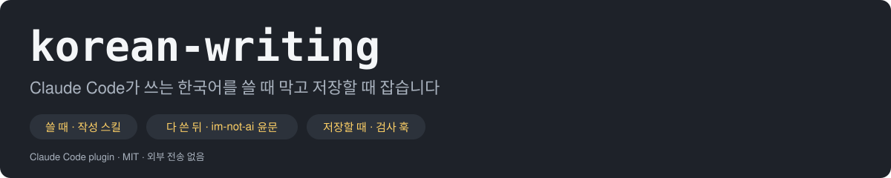

<picture>
  <source media="(prefers-color-scheme: dark)" srcset="docs/banner.svg">
  <source media="(prefers-color-scheme: light)" srcset="docs/banner-light.svg">
  
</picture>

<p align="center">
  <strong>한국어</strong> · <a href="README.en.md">English</a>
</p>

<p align="center">
  <strong>Claude Code가 쓰는 한국어의 품질을 맡는 플러그인.</strong><br>
  처음 쓸 때 잡고 이미 쓴 글은 다듬고 편집은 검사합니다.
</p>

<p align="center">
  <a href="https://github.com/IsthisLee/claude-korean-writing/actions/workflows/validate.yml"></a>
  
  
  
  
  
</p>

<p align="center">
  <a href="#개요">개요</a> ·
  <a href="#설치">설치</a> ·
  <a href="#사용법">사용법</a> ·
  <a href="#동작-원리">동작 원리</a> ·
  <a href="#파일-구조">파일 구조</a> ·
  <a href="#훅이-잡는-것">훅이 잡는 것</a> ·
  <a href="#어디까지-맡나">어디까지 맡나</a> ·
  <a href="#검증">검증</a> ·
  <a href="#자주-묻는-질문">FAQ</a>
</p>

> **v1.0.0**: 첫 릴리스입니다. 스킬 4종(처음 쓰기·윤문·글자 수·README 구성), `.md` 편집을 검사하는 훅, 문서 검사와 릴리스 스크립트를 담았습니다. 상세: [CHANGELOG.md](CHANGELOG.md)

> **korean-writing은 Claude Code가 쓰는 모든 한국어의 품질을 맡습니다.** 설치하면 평소 답변부터 규칙이 붙습니다. **"운영팀에 보낼 안내문 써줘"**라고 말하면 스킬이 스스로 로드되어 처음부터 자연스러운 한국어로 씁니다. `.md` 파일을 고치면 훅이 번역투와 AI 관용구를 잡아 알려줍니다. 원문은 어디로도 나가지 않습니다.

## 개요

Claude Code는 한국어를 문법에 맞게 씁니다. 그런데 읽으면 걸립니다. 영어 문장을 옮긴 흔적이 남기 때문입니다. 아래는 실제로 생성됐던 문장과 그 교정입니다.

| 전                                                                  | 후                                                                 |
| ------------------------------------------------------------------- | ------------------------------------------------------------------ |
| 변경이 실패하면 화면이 **굳어** 취소도 안 됩니다                    | 변경이 실패하면 화면이 **멈춰** 취소도 안 됩니다                   |
| 점검 장치가 장비를 계속 **넘어뜨리고 있었습니다**                   | 점검 장치 **때문에** 장비가 계속 **멈췄습니다**                    |
| 그대로 내보냈으면 탈이 날 **것들이었습니다**                        | 그대로 내보냈으면 탈이 날 **문제였습니다**                         |
| **축이** 두 개다. 세 **갈래**로 나뉜다                              | **기준이** 두 개다. 세 **가지**로 나뉜다                           |
| 충돌하면 상위 문서가 **이깁니다**                                   | 충돌하면 상위 문서를 **따릅니다**                                  |
| 원인은 힙 부족이 아니라 **—** 실측해보니 **—** 설정이 안 먹혔습니다 | 원인은 힙 부족이 아니었습니다**.** 실측해보니 설정이 안 먹혔습니다 |

왼쪽이 틀린 것은 아닙니다. 다만 사람이 한국어로 쓸 때는 나오지 않는 표현입니다. 이 플러그인은 그런 문장이 나오는 길목 다섯 곳에 하나씩 붙습니다. README에는 절 구성을 잡는 스킬이 하나 더 붙습니다.

| 길목                   | 붙는 것                           | 하는 일                                                                     |
| ---------------------- | --------------------------------- | --------------------------------------------------------------------------- |
| 평소 답변을 쓸 때      | SessionStart 훅(상시 규칙 주입)   | 세션이 열릴 때 규칙 요약을 한 번 넣습니다. 스킬이 뜨지 않는 답변을 맡습니다 |
| 글을 처음 쓸 때        | `korean-writing` 스킬             | 슬랙·메일·공지·보고서 요청에 스스로 로드되어 처음부터 규칙을 적용합니다     |
| 이미 쓴 글을 고칠 때   | `humanize-korean` 스킬            | 사실과 숫자는 그대로 두고 문체만 손봅니다                                   |
| `.md` 파일을 편집할 때 | PostToolUse 훅(편집 직후 검사)    | 이번에 쓴 부분에서 AI 티 패턴 8종을 찾아 알립니다                           |
| 글자 수 제한이 있을 때 | `korean-character-count` 스킬     | 모델이 어림하지 않도록 스크립트가 셉니다                                    |
| README를 쓸 때         | `crafting-effective-readmes` 스킬 | 프로젝트 유형에 맞춰 절을 고릅니다. 문장은 `korean-writing` 규칙으로 씁니다 |

> 비유하면 초고 옆에 앉은 교정자입니다. 다 쓴 뒤에 고치는 것이 아니라, 쓰는 동안 어색한 문장을 짚습니다.

## 설치

```bash
claude plugin marketplace add IsthisLee/claude-korean-writing
claude plugin install korean-writing
```

설치하면 끝입니다. 설정할 것이 없습니다.

저장소를 받아 둔 경로로도 설치할 수 있습니다. 사내 사본이나 포크를 쓸 때입니다.

```bash
claude plugin marketplace add /경로/claude-korean-writing
claude plugin install korean-writing
```

**필요한 것**

- Claude Code (2.1.266에서 확인했습니다)
- `python3`(훅), `node` 18 이상(글자 수 스크립트). 별도 패키지는 설치하지 않습니다
- 훅이 bash 스크립트라 macOS에서 확인했습니다. Windows는 확인하지 않았습니다

## 사용법

평소처럼 말하면 됩니다. 스킬은 요청 내용을 보고 스스로 로드됩니다. 직접 부르려면 슬래시 이름을 씁니다.

| 하고 싶은 것                      | 이렇게 말하면                                             | 직접 부를 때                                 |
| --------------------------------- | --------------------------------------------------------- | -------------------------------------------- |
| 밖으로 나갈 글을 처음부터 잘 쓰기 | "운영팀에 보낼 옵션 변경 안내문 써줘. 슬랙에 캐주얼하게." | `/korean-writing`                            |
| 이미 쓴 글의 번역투 걷어내기      | "아래 글 번역투만 고쳐줘. 사실과 숫자는 그대로 두고."     | `/korean-writing:humanize-korean`            |
| 글자 수 정확히 세기               | "이 자기소개서 공백 포함 몇 자야? 1,000자 제한이야."      | `/korean-writing:korean-character-count`     |
| README 쓰기                       | "이 프로젝트 README 써줘. 오픈소스용으로."                | `/korean-writing:crafting-effective-readmes` |

윤문은 주요 교정 3~6개를 전 → 후로 보여 줍니다. 변경률이 50%를 넘으면 결과 대신 그 사실을 알립니다. 그건 윤문이 아니라 재작성이기 때문입니다. README 스킬은 프로젝트 유형(오픈소스·개인·사내·설정)에 맞춰 절을 고르고 문장은 `korean-writing` 규칙으로 씁니다.

글자 수는 grapheme(사람이 한 글자로 보는 단위) 기준이고 줄 수와 바이트를 함께 냅니다. 아래는 이모지가 든 두 줄짜리 문장을 실제로 넣은 출력입니다. 계약 설명 세 줄은 뺐습니다.

```
$ node skills/korean-character-count/scripts/korean_character_count.js --text "옵션 변경은 …" --format text
profile: default
characters: 47
characters_without_whitespace: 35
code_points: 47
utf16_code_units: 48
lines: 2
bytes_utf8: 116
bytes_neis: 117
```

`.md` 파일을 고치면 훅이 자동으로 검사합니다. 실제로는 이렇게 보입니다.

<p align="center"></p>

편집을 되돌리지는 않습니다. 걸린 항목과 고치는 법을 알려 줍니다. 고칠지는 사람이 정합니다.

이미 써 둔 문서를 통째로 검사하려면 `scripts/check.sh 파일...`을 씁니다. 훅과 같은 기준으로 봅니다. 걸린 파일이 있으면 종료 코드 1을 냅니다. CI와 pre-commit에서 그대로 쓸 수 있습니다. 설치 경로는 `claude plugin list`의 Path에 나옵니다.

```bash
scripts/check.sh docs/*.md
```

끄는 방법은 넷입니다. 파일 하나만 빼려면 그 파일 머리에 `<!-- korean-writing: ignore -->`를 넣습니다. 계약서처럼 격식이 요건인 문서에 씁니다. 세션 전체를 끄려면 `KOREAN_WRITING_HOOK_DISABLED=1`, 상시 규칙 주입만 빼려면 `KOREAN_WRITING_ALWAYS_ON_DISABLED=1`, 플러그인째 끄려면 `claude plugin disable korean-writing`입니다.

## 동작 원리

스킬 넷과 훅 둘이 각자 다른 시점에 붙습니다. 세션이 열리면 상시 규칙이 들어가고, 요청이 오면 스킬이 골라지고, 파일을 저장하면 검사 훅이 돕니다.

### 어느 스킬이 나서나

```
요청
├─ 아직 쓰지 않은 글               korean-writing               처음부터 규칙대로 씁니다
├─ 이미 쓴 글을 다듬어 달라         humanize-korean              사실은 두고 문체만 손봅니다
├─ 글자 수나 바이트를 세 달라       korean-character-count       스크립트가 셉니다
└─ README 를 만들거나 고쳐 달라     crafting-effective-readmes   절을 고르고, 문장은 korean-writing 규칙으로 씁니다
```

스킬끼리는 서로 넘깁니다. 아직 쓰지 않은 글을 윤문해 달라고 하면 `humanize-korean`이 `korean-writing`으로 돌려보내고 다 쓰고도 기준에 못 미치면 `korean-writing`이 `humanize-korean`으로 넘깁니다. 윤문은 한글 5,000자가 넘으면 논리 단위로 나눠 돌리고 8,000자가 넘거나 정확도가 특히 중요한 글은 단일 패스로 부족하다고 알립니다.

### 요청에서 출력까지

| 단계   | 일어나는 일                                                                                                      |
| ------ | ---------------------------------------------------------------------------------------------------------------- |
| 0 시작 | 세션이 열리면 SessionStart 훅이 `hooks-handlers/always-on.md`를 한 번 넣습니다. 약 660토큰이고 캐시에 올라갑니다 |
| 1 요청 | "안내문 써줘" 같은 요청이 오면 스킬 설명과 맞는지 봅니다. 상시로 읽히는 것은 이 설명과 위 규칙뿐입니다          |
| 2 로드 | 맞으면 `SKILL.md`(원칙·품질 기준·교정 예시)를 읽고 그 규칙으로 씁니다                                            |
| 3 판정 | 다듬을 때는 `references/quick-rules.md`로 훑고 애매한 것만 `references/taxonomy.md`(10분류 73항목)로 확인합니다  |
| 4 편집 | `.md`를 저장하면 훅이 이번에 쓴 부분만 정규식으로 검사하고 걸리면 stderr로 알립니다. LLM을 부르지 않습니다       |

네 층으로 나눈 이유는 비용입니다. 평소에는 짧은 규칙과 설명 한 줄만 읽히고 깊은 판정이 필요할 때만 큰 파일을 엽니다.

```
hooks-handlers/always-on.md    0.6 KB   세션마다 한 번. 답변용 규칙 요약
SKILL.md                        7.7 KB   글쓰기 요청에 로드. 원칙·품질 기준·교정 예시
references/quick-rules.md       9.7 KB   다듬기 시작할 때. 압축 룰북
references/taxonomy.md         66   KB   판정이 애매할 때만. 10분류 73항목
```

### 상시 규칙은 이렇게 들어갑니다

```
세션이 열린다 (시작 · 재개 · /clear · 압축)
  ├─ KOREAN_WRITING_HOOK_DISABLED=1 이거나 KOREAN_WRITING_ALWAYS_ON_DISABLED=1 이면   아무것도 안 함
  ├─ hooks-handlers/always-on.md 가 없거나 읽히지 않으면                              아무것도 안 함
  ├─ 파일에서 제외 표시 줄을 뺀다  (주입문에 들어가면 지시문으로 읽힙니다)
  └─ 나머지를 stdout 으로 낸다. Claude Code 가 추가 컨텍스트로 넣는다
```

이 훅은 무엇도 막지 않습니다. 어떤 경우에도 종료 코드 0으로 끝납니다. 압축이 일어나면 다시 넣습니다. 앞쪽 컨텍스트가 잘려도 규칙이 남아야 하기 때문입니다.

### 훅은 이렇게 판정합니다

```
Edit · Write · MultiEdit 가 끝난다
  ├─ KOREAN_WRITING_HOOK_DISABLED=1 이거나 python3 가 없으면          통과
  ├─ .md 가 아니면                                         통과
  ├─ 파일 머리나 이번에 쓴 부분에 korean-writing: ignore 표시가 있으면  통과
  ├─ 이번에 쓴 부분만 모은다  (content, new_string, edits[].new_string)
  ├─ 코드블록 · 인라인 코드 · URL · 표 행 · HTML 주석을 뺀다
  ├─ 한글 비중이 30% 미만이면 한글 비중 30% 이상인 줄만 남긴다   (영어 문서 안의 한국어 문단)
  ├─ 남은 한글이 20자 미만이면                                   통과
  ├─ K1 ~ K8 정규식을 돌린다
  ├─ 줄표는 이번 편집에 하나라도 있으면 파일 전체 개수로 판정한다   (문단씩 고치며 쌓이는 것)
  └─ 걸린 것이 있으면 stderr 에 항목과 고치는 법을 쓰고 exit 2. 파일은 그대로 둔다
```

파일 전체가 아니라 이번에 쓴 부분만 보는 이유는 소음입니다. 전체를 보면 예전 표현이 매 편집마다 다시 걸립니다. 표를 통째로 빼는 이유는 이 README 때문입니다. 위 전/후 교정표의 '전' 칸에 있는 나쁜 예가 위반으로 잡혔습니다. 편집분이 영어 위주여도 한국어 문단이 있으면 그 줄들만 모아 같은 기준으로 봅니다. 영어 줄은 빠지므로 영어 산문의 줄표는 세지 않습니다. 줄표만은 파일 전체를 봅니다. 문단 하나씩 고치는 동안 파일에 줄표가 34개, 66개, 207개 쌓인 실제 문서가 있었는데 편집분만 세면 한 번도 안 걸리기 때문입니다. 이번 편집에 줄표가 없으면 파일에 아무리 많아도 잡지 않습니다.

### 임계는 규칙집보다 한 단계 느슨합니다

훅은 막는 장치가 아니라 알리는 장치입니다. 오탐이 정상 작업을 막으면 사람이 훅을 꺼 버립니다. 그래서 규칙집이 "1회 이하"라고 하면 훅은 2회부터 잡습니다.

| 코드                           | 훅이 잡는 시점                                         | 규칙집의 처방                                                                              |
| ------------------------------ | ------------------------------------------------------ | ------------------------------------------------------------------------------------------ |
| `K1` 줄표 삽입구               | 4개. 이번 편집에 하나라도 있으면 파일 전체 개수로 판정 | `SKILL.md`는 한 문서 두 번까지. taxonomy J-3은 내부 문서 1~2회 이하                        |
| `K2` 추상 구조어               | 3회                                                    | taxonomy D-9. 네 단어 합쳐 한 문서 2회 이하                                                |
| `K6` 승패 의인화               | 2회                                                    | taxonomy D-8. 한 문서 1회 이하                                                             |
| `K4` AI 관용구                 | 1회                                                    | taxonomy D 분류. S1이라 한 번만 나와도 교체                                                |
| `K5` 기계적 병렬               | 첫째와 둘째가 같이 나올 때                             | taxonomy C-1. S1                                                                           |
| `K3` 것 구문, `K7` 사물 의인화 | 1회                                                    | `SKILL.md`의 문장 규칙. 정답 데이터의 실제 실패 문장에서 나온 항목                         |
| `K8` 번역투                    | `~에 의해` 2회, `가지고 있다`·이중 피동 1회            | taxonomy A-7·A-8은 S1, A-9는 S2. `~에 대해`·`~를 통해` 횟수는 실측에서 사람 글만 잡아 뺐다 |

`K6`은 처음에 1회에서 걸었다가 규칙집보다 엄격해서 2회로 올렸습니다. 이런 조정은 [`EVALUATION.md`](./EVALUATION.md)의 「측정 중 고친 것」에 남깁니다.

## 파일 구조

| 구성        | 수     | 무엇                                                                                        |
| ----------- | ------ | ------------------------------------------------------------------------------------------- |
| 스킬        | 4      | `korean-writing`, `humanize-korean`, `korean-character-count`, `crafting-effective-readmes` |
| 훅          | 2      | SessionStart(상시 규칙 주입), PostToolUse(패턴 8종 `K1`~`K8`)                              |
| 규칙집      | 2      | `quick-rules.md`(압축), `taxonomy.md`(10분류 73항목, 심각도, 처방)                          |
| 스크립트    | 4      | 글자 수(`node`), 통째 검사·오탐 측정·릴리스(`bash`)                                         |
| 검증 데이터 | 15문장 | 위반 10건, 정상 5건. 회귀 테스트 61건                                                       |

```
korean-writing/
├── .github/
│   ├── workflows/validate.yml        push·PR마다 회귀 테스트, shellcheck, 버전 일치, validate
│   ├── ISSUE_TEMPLATE/               어색한 문장 제보, 버그, 판정 규칙 제안
│   ├── PULL_REQUEST_TEMPLATE.md      확인한 명령과 실측을 적는 자리
│   ├── CODEOWNERS                    판정 규칙과 가져온 파일의 리뷰어
│   └── dependabot.yml                GitHub Actions 버전 갱신
├── .claude/settings.json             기여자용 프로젝트 설정. 검증 명령은 허용, 가져온 파일 편집은 확인
├── .claude-plugin/
│   ├── plugin.json                   매니페스트. 이름·버전·스킬 4개 경로. 버전의 정본
│   └── marketplace.json              마켓플레이스 카탈로그. 버전은 두지 않습니다
├── SKILL.md                          korean-writing 스킬. 처음 쓸 때 규칙과 교정 예시
├── references/
│   ├── quick-rules.md                압축 룰북. 윤문 첫 패스용
│   └── taxonomy.md                   AI 티 분류 체계. 10분류 73항목, 심각도, 처방
├── skills/
│   ├── humanize-korean/SKILL.md      이미 쓴 글 윤문. 사실 불변, 변경률 상한
│   ├── korean-character-count/
│   │   ├── SKILL.md                  어느 값을 쓰는지 고르는 법
│   │   ├── instruction.md            세는 규칙의 계약. grapheme, 줄바꿈, NEIS 바이트
│   │   └── scripts/korean_character_count.js   node:fs 만 쓰는 카운터
│   └── crafting-effective-readmes/   README 절 구성. 템플릿 4종, 참고 문서 5종
├── hooks/hooks.json                  훅 등록. SessionStart 와 PostToolUse, 각 10초 제한
├── hooks-handlers/
│   ├── always-on.md                  세션마다 주입되는 답변용 규칙. 약 660토큰
│   ├── sessionstart.sh               주입 본체. 규칙을 stdout 으로 냅니다
│   ├── posttooluse.sh                검사 본체. python3 정규식 K1~K8
│   ├── ground-truth.json             실제로 생성됐던 위반 문장 10건
│   ├── clean.json                    같은 맥락의 정상 문장 5건
│   ├── test_posttooluse.py           회귀 43건. 보고 횟수까지 검증해 변이를 잡습니다
│   └── test_sessionstart.py          회귀 18건. 주입 내용·끄기·안전 종료
├── docs/                             배너(한·영, 밝음·어두움), 훅 출력 데모, 소셜 프리뷰
├── scripts/
│   ├── check.sh                      파일을 통째로 훅에 넣어 검사. CI·pre-commit 용
│   ├── measure.sh                    실제 문서 뭉치의 오탐 측정. 분기마다
│   └── release.sh                    버전·CHANGELOG·배지·태그를 한 번에
├── EVALUATION.md                     합격 기준과 측정 결과
├── CHANGELOG.md                      릴리스 노트
├── CLAUDE.md                         이 저장소에서 작업하는 Claude 를 위한 규칙
├── CONTRIBUTING.md · .en.md          기여 절차. 규칙을 바꾸려면 실측이 필요합니다
├── CODE_OF_CONDUCT.md                Contributor Covenant 2.1 한국어판
├── SECURITY.md                       신고 절차, 훅이 무엇을 읽고 무엇을 하지 않는지
├── LICENSE                           MIT 본문
├── NOTICE.md                         가져온 파일의 원 저작권 표시와 파일별 범위
└── README.md · README.en.md
```

## 훅이 잡는 것

`.md`를 편집하면 **이번에 쓴 부분만** 검사합니다. 파일 전체를 보면 예전 표현이 매 편집마다 다시 걸려 소음이 됩니다.

| 코드 | 패턴             | 예                                         | 임계                                   |
| ---- | ---------------- | ------------------------------------------ | -------------------------------------- |
| `K1` | 줄표 삽입구      | `가 — 나 — 다`                             | 4개. 이번 편집에 있으면 파일 전체로 셈 |
| `K2` | 추상 구조어      | `축`·`갈래`·`결이 다`·`레이어`             | 3회                                    |
| `K3` | 번역투 `것` 구문 | `탈이 날 것들이었다`                       | 1회                                    |
| `K4` | AI 관용구        | `결론적으로`·`혁신적`·`시사하는 바가 크다` | 1회                                    |
| `K5` | 기계적 병렬      | `첫째 … 둘째 …`                            | 동시 등장                              |
| `K6` | 승패 의인화      | `규칙이 이깁니다`                          | 2회                                    |
| `K7` | 사물 의인화      | `화면이 굳어`·`장비를 넘어뜨리고`          | 1회                                    |
| `K8` | 번역투           | `되어지`·`가지고 있다`·`~에 의해`          | 항목별                                 |

코드블록(``` 과 ~~~), 인라인 코드, URL, 표 행, HTML 주석은 검사하지 않습니다. 이번에 쓴 부분의 한글 비중이 30% 미만이면 한글 비중 30% 이상인 줄만 모아 보고 그래도 한글이 20자 미만이면 대상이 아닙니다.

## 패턴의 근거

**외부 출판사 편집부의 지적이 근거입니다.** 단행본 초고 검토에서 줄표 삽입구와 `이깁니다` 류를 "요즘 원고에 공통적으로 나온다. 잘못된 표현은 아니지만 AI 생성 의심을 살 수 있다"고 짚었습니다. 서로 다른 저자의 원고 2건에서 같은 자리에 같은 `이깁니다`가 나오기도 했습니다.

문법적으로 맞아도 AI 서명처럼 굳은 표현은 피합니다. 그것이 이 플러그인의 기준입니다.

**목적은 탐지기 우회가 아닙니다.** 어색한 번역투를 자연스러운 한국어로 고치는 것이고 누가 초안을 썼는지와 무관한 품질 개선입니다.

## 검증

합격 기준과 측정 결과는 [`EVALUATION.md`](./EVALUATION.md)에 있습니다.

| 기준               | 결과           |
| ------------------ | -------------- |
| 위반 검출          | 10 / 10        |
| 정상 오탐          | 0 / 5          |
| 실문서 오탐        | 1 / 143 (0.7%) |
| 분류 정확          | 10 / 10        |
| 변이 검출          | 15 / 15        |
| 회귀 테스트        | 61 / 61        |
| 외부 호출          | 0건            |
| 상시 규칙 효과     | 21승 0패 3무   |
| 상시 컨텍스트 비용 | 약 930토큰     |

정답 데이터는 [`hooks-handlers/ground-truth.json`](./hooks-handlers/ground-truth.json)에 있습니다. **실제로 생성됐던 어색한 문장 10건과 같은 맥락의 정상 문장 5건**이고 합성 예문이 아닙니다.

**오탐을 미탐보다 무겁게 봅니다.** 검사가 정상 작업을 막으면 사람이 검사를 꺼 버리기 때문입니다.

상시 규칙의 효과는 프롬프트 12개에 조건 2개와 표본 2개로 48건을 생성하고 같은 모델이 순서를 바꿔 두 번씩 블라인드로 판정해 쟀습니다. 24쌍에서 주입 쪽이 21승 3무 0패였고 12개 프롬프트 전부에서 이기거나 비겼습니다. 문체를 빼고 기술 오류만 따로 본 검사에서는 심각한 오류가 양쪽 0건입니다. 자세한 것은 [`EVALUATION.md`](./EVALUATION.md)의 C5에 있습니다.

스킬 유무를 같은 프롬프트 4개로 비교한 결과는 [`EVALUATION.md`](./EVALUATION.md)의 C4에 있습니다. 2026-09-10의 claude-opus-5에서는 두 조건 모두 훅을 통과해 생성 단계 효과를 이 표본으로 구분하지 못했습니다. 훅은 모델이 바뀌어도 남는 안전망입니다.

변이 테스트는 훅에 결함을 심고 회귀 테스트가 잡는지 확인합니다. 정규식 대안 하나가 조용히 빠지는 경우까지 검출합니다.

```bash
python3 hooks-handlers/test_posttooluse.py
python3 hooks-handlers/test_sessionstart.py
```

같은 검사를 GitHub Actions가 push와 PR마다 돌립니다(`.github/workflows/validate.yml`). 회귀 테스트, 매니페스트와 이슈 양식의 JSON·YAML 문법, 훅의 실행 비트, 한국어 문서 13종이 자기 훅을 통과하는지, 글자 수 스크립트 스모크를 **macOS와 Linux 양쪽에서** 돌립니다. 여기에 shellcheck, 버전 표기 일치, `claude plugin validate`가 더해집니다.

## 이웃 도구와의 관계

| 도구                                                        | 그쪽은                                                                                                              | 이 플러그인은                                                                                                                                                               |
| ----------------------------------------------------------- | ------------------------------------------------------------------------------------------------------------------- | --------------------------------------------------------------------------------------------------------------------------------------------------------------------------- |
| [claude-forge](https://github.com/sangrokjung/claude-forge) | Claude Code 전체 프레임워크입니다. 에이전트·커맨드·훅·규칙 묶음이고 한국어 산문 품질 가드레일은 그중 한 부분입니다  | 그 부분만 떼어 독립시킨 것입니다. Forge를 `install.sh`로 전체 설치했다면 같은 훅과 윤문 스킬이 이미 있으니 이 플러그인은 필요 없습니다. 둘을 같이 쓰면 줄표 검사가 겹칩니다 |
| [k-skill](https://github.com/NomaDamas/k-skill)             | 한국인을 위한 스킬 모음집입니다. 글자 수·맞춤법부터 교통·날씨·검색까지 100개가 넘습니다                             | 글자 수 스킬만 가져왔습니다. 맞춤법 검사는 원문을 외부 서버로 보내서 뺐습니다. 필요하면 k-skill에서 따로 설치하되 그 점을 알고 쓰는 편이 좋습니다                           |
| 맞춤법·띄어쓰기 검사기                                      | 맞춤법을 봅니다                                                                                                     | 문체만 봅니다. 둘은 겹치지 않으니 같이 쓰면 됩니다                                                                                                                          |

## 어디까지 맡나

"모든 한국어"가 어디까지인지 적어 둡니다.

| 자리                                  | 맡는 것                   | 상태                                                       |
| ------------------------------------- | ------------------------- | ---------------------------------------------------------- |
| 평소 채팅 답변                        | SessionStart 상시 규칙    | 걸립니다                                                   |
| 슬랙·메일·보고서·커밋 메시지·README   | `korean-writing` 스킬     | 걸립니다                                                   |
| 이미 쓴 글의 윤문                     | `humanize-korean` 스킬    | 걸립니다                                                   |
| `.md` 파일 편집                       | PostToolUse 훅            | 걸립니다. 이번에 쓴 부분만 봅니다                          |
| 코드 안의 한국어 주석과 문자열        | 상시 규칙                 | 생성 단계만. 훅은 `.md` 만 보므로 검사하지 않습니다        |
| 서브에이전트가 쓰는 한국어            | 상시 규칙                 | 미확인. SessionStart 주입이 전파되는지 재지 않았습니다     |
| 슬랙 전송처럼 도구로 나가는 텍스트    | 상시 규칙                 | 생성 단계만. 보내기 직전에 검사하는 장치는 없습니다        |

## 적용하지 않는 것

- **격식이 요건인 글**: 계약서, 약관, 법률 문서, 공문. 딱딱한 것이 그 글의 요건입니다
- 코드, 로그, 명령어, 직접 인용, 고유명사, 영어 원문
- 맞춤법·띄어쓰기 검사. 이 플러그인은 문체만 봅니다

정규식은 알려진 패턴만 잡습니다. 새로운 어색함은 사람이 찾아 목록에 넣어야 합니다. **"모든 한국어를 맡는다"는 모든 자리에 붙는다는 뜻이지 모든 어색함을 잡는다는 뜻이 아닙니다.**

## 자주 묻는 질문

<details>
<summary><b>Q1. 위반 검출 10/10이면 다 잡는다는 뜻인가요?</b></summary>

**A.** 아닙니다. 정답 10건으로 패턴을 만들었으니 그 10건이 잡히는 것은 당연하고 이 숫자는 고치다 깨뜨리지 않았는지 보는 회귀용입니다. 의미 있는 숫자는 오탐 쪽입니다. 이 머신에 쌓인 한국어 문서 143개를 통째로 넣어 60개가 걸렸습니다. 59개는 2026년에 Claude가 쓴 문서였고 사람이 쓴 문서는 1개(0.7%)였습니다. 정규식은 알려진 패턴만 잡으므로 새로운 어색함은 놓칩니다.

**근거:**

- [`EVALUATION.md`](./EVALUATION.md) 기준 A1·A3
- [`hooks-handlers/ground-truth.json`](./hooks-handlers/ground-truth.json)

</details>

<details>
<summary><b>Q2. 훅이 편집을 되돌리나요?</b></summary>

**A.** 아닙니다. 걸린 항목을 stderr로 알리고 종료 코드 2를 낼 뿐 파일은 건드리지 않습니다. 고칠지는 사람이 정합니다.

</details>

<details>
<summary><b>Q3. 내 글이 외부로 나가나요?</b></summary>

**A.** 아닙니다. 훅은 `python3` 정규식이고 글자 수 스크립트는 `node:fs`만 씁니다. 네트워크 호출이 한 건도 없습니다. 원문을 외부 서버로 보내는 `korean-spell-check`를 가져오지 않은 이유이기도 합니다.

</details>

<details>
<summary><b>Q4. 오탐이 나면요?</b></summary>

**A.** 격식 문서(계약·약관·법률)면 파일 머리에 `<!-- korean-writing: ignore -->`를 넣습니다. 그 파일은 다시 알리지 않습니다. 세션 전체를 끄려면 `KOREAN_WRITING_HOOK_DISABLED=1`입니다. 패턴 자체가 틀렸으면 `hooks-handlers/test_posttooluse.py`에 그 문장을 오탐 케이스로 넣고 훅을 고칩니다(「개발과 기여」). 훅째 끄려면 `claude plugin disable korean-writing`입니다.

</details>

<details>
<summary><b>Q5. 토큰을 얼마나 쓰나요?</b></summary>

**A.** 상시로 드는 것은 스킬 설명 넷(약 270토큰)과 답변용 규칙(659토큰)이고 합쳐서 약 930토큰입니다. 세션 시작 컨텍스트가 1만 토큰 남짓이니 6~7% 늘어납니다. 규칙은 세션마다 한 번 들어가 프롬프트 캐시에 올라가므로 턴마다 다시 내지 않습니다. 실측한 턴당 비용 차이는 0.0029달러에서 0.0031달러로 0.0002달러입니다. 스킬 본문은 글쓰기 요청이 있을 때만 로드되고 훅은 LLM을 부르지 않는 정규식입니다. 답변마다 다시 검토하는 Stop 훅은 그래서 두지 않았습니다.

</details>

<details>
<summary><b>Q6. 왜 <code>.md</code> 파일만 검사하나요?</b></summary>

**A.** 검사 훅은 파일 편집 도구에만 걸립니다. 슬랙 메시지처럼 파일이 아닌 답변은 이 훅이 볼 수 없습니다. 그 자리는 세션 시작에 들어가는 상시 규칙과 스킬이 맡습니다. 생성 단계에서 잡는 방식이라 사후 검사는 없습니다.

</details>

## 개발과 기여

기여 절차, 규칙을 바꿀 때 필요한 실측, PR 체크리스트는 [CONTRIBUTING.md](./CONTRIBUTING.md)에 있습니다. 참여하는 사람은 [행동 강령](./CODE_OF_CONDUCT.md)을 따르고, 보안 문제는 공개 이슈 대신 [SECURITY.md](./SECURITY.md)의 절차로 보냅니다.

저장소를 `~/.claude/skills/`로 링크하면 `korean-writing@skills-dir`로 자동 로드됩니다. 마켓플레이스를 거치지 않으므로 고치는 즉시 반영됩니다.

마켓플레이스로 설치한 사본이 있으면 그쪽이 우선하고 링크 사본은 로드되지 않습니다. 개발 전에 `claude plugin uninstall korean-writing`으로 설치본을 빼 주세요.

```bash
git clone https://github.com/IsthisLee/claude-korean-writing.git
ln -s "$PWD/claude-korean-writing" ~/.claude/skills/korean-writing
claude plugin list                            # loaded 확인
python3 hooks-handlers/test_posttooluse.py    # 검사 훅 회귀 43건
python3 hooks-handlers/test_sessionstart.py   # 상시 규칙 회귀 18건
```

패턴을 추가하려면 세 곳을 함께 고칩니다.

1. `hooks-handlers/posttooluse.sh`에 검사 추가
2. `hooks-handlers/ground-truth.json`에 실제 문장 추가
3. `hooks-handlers/test_posttooluse.py`에 케이스 추가. 오탐 케이스를 먼저

규칙을 고쳤으면 실제 문서 뭉치에 돌려 오탐이 늘지 않았는지 봅니다. `scripts/measure.sh ~/Documents`처럼 문서가 쌓인 디렉터리를 주면 걸린 파일과 코드별 수를 냅니다. 걸린 파일이 사람이 쓴 글인지 Claude가 쓴 글인지는 사람이 판단합니다.

**어색한 문장을 발견하면 이슈로 보내 주세요.** 이 플러그인의 정답 데이터는 실제로 생성됐던 문장만 씁니다. 합성 예문보다 실제 실패 한 건이 더 값집니다. 이슈 양식 「어색한 문장 제보」에 문장, 어떤 요청에서 나왔는지, 훅이 잡았는지를 적으면 됩니다.

## 버전과 릴리스

[SemVer](https://semver.org/lang/ko/)를 따릅니다. 버전은 `.claude-plugin/plugin.json` 한 곳에만 두고 릴리스 스크립트가 나머지에 전파합니다.

| 올리는 자리 | 언제                                                                                  |
| ----------- | ------------------------------------------------------------------------------------- |
| 패치        | 오탐 줄이기, 문구, 문서                                                               |
| 마이너      | 새 패턴이나 스킬, 더 많이 잡게 되는 임계 변경, 목적·구성 변경                         |
| 메이저      | 훅이 편집을 막기 시작하는 것처럼 동작 약속이 바뀌거나, 스킬 이름이 바뀌거나 없어질 때 |

릴리스 노트는 [`CHANGELOG.md`](./CHANGELOG.md)의 `[Unreleased]` 아래에 쓰고 두 README 상단 인용구를 고친 뒤 스크립트를 돌립니다.

```bash
scripts/release.sh 1.1.0          # 테스트·validate·버전 반영·CHANGELOG·커밋·태그
scripts/release.sh 1.1.0 --push   # 여기에 git push --follow-tags 와 GitHub 릴리스까지
```

## 출처

규칙집은 [im-not-ai](https://github.com/epoko77-ai/im-not-ai), 윤문 스킬과 압축 룰북은 [claude-forge](https://github.com/sangrokjung/claude-forge), 글자 수 스크립트는 [k-skill](https://github.com/NomaDamas/k-skill), README 스킬은 [agent-toolkit](https://github.com/softaworks/agent-toolkit)에서 가져왔습니다. `korean-writing` 스킬, 훅의 K2~K8, 실제 실패 문장으로 만든 검증은 여기서 썼습니다.

| 파일                                           | 원본                                                                                                                            | 바꾼 것                                                                    |
| ---------------------------------------------- | ------------------------------------------------------------------------------------------------------------------------------- | -------------------------------------------------------------------------- |
| `references/taxonomy.md`                       | [im-not-ai](https://github.com/epoko77-ai/im-not-ai) `skills/humanize-korean/references/ai-tell-taxonomy.md`, claude-forge 경유 | 머리에 훅 제외 표시 한 줄                                                  |
| `references/quick-rules.md`                    | claude-forge `skills/humanize-korean/references/quick-rules.md`                                                                 | 없는 파일을 가리키던 경로 두 곳만 `taxonomy.md`로                          |
| `skills/humanize-korean/SKILL.md`              | claude-forge `skills/humanize-korean/SKILL.md`                                                                                  | 한국어로 옮기고 구조 정리. 절차와 철칙은 원본과 같음                       |
| `hooks-handlers/posttooluse.sh`                | claude-forge `hooks/emdash-slop-guard.sh`                                                                                       | 발동 조건(`.md` 편집, 한글 비중)과 K1 정규식만 가져오고 나머지는 여기서 씀 |
| `skills/korean-character-count/scripts/*.js`   | [k-skill](https://github.com/NomaDamas/k-skill)                                                                                 | 없음                                                                       |
| `skills/korean-character-count/instruction.md` | k-skill                                                                                                                         | 실행 경로만 `node`로                                                       |
| `skills/korean-character-count/SKILL.md`       | k-skill                                                                                                                         | 원본을 바탕으로 다시 씀                                                    |
| `skills/crafting-effective-readmes/**`         | [agent-toolkit](https://github.com/softaworks/agent-toolkit)                                                                    | `style-guide.md`와 스킬 README의 관련 스킬 한 줄                           |

모두 MIT입니다. 원 저작권 표시와 파일별 범위는 [`NOTICE.md`](./NOTICE.md)에 있습니다.

`korean-spell-check`는 가져오지 않았습니다. 검사할 원문을 외부 서버로 전송하고 그 서비스 약관이 개인·학생 무료로 제한합니다.

## 라이선스

[MIT](./LICENSE)
